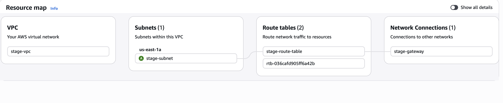
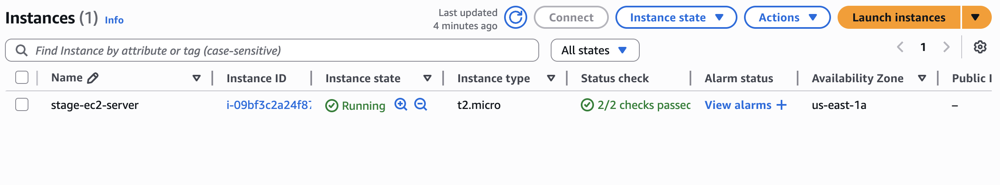

# Provisioning AWS Infrastruction using Terraform

## Overview

This project demonstrates how to build a basic AWS infrastructure using Terraform while following an industry-standard modular structure.

The main goal of this project is to gain hands-on experience with Infrastructure as Code (IaC) by creating reusable Terraform modules to provision common AWS resources such as a VPC, Subnets, Internet Gateway, Route Tables, Security Groups, and EC2 instances.

Each infrastructure component is implemented as a separate Terraform module. The root module connects these modules together by passing outputs from one module as inputs to another. This modular approach improves code organization, reusability, and scalability, which is a common practice in real-world DevOps environments.

By using this structure, the project simulates how cloud infrastructure is typically managed in production environments using Terraform.

## Terraform Commands

```bash
# 1. Initialization: Setup the working directory
terraform init

# 2. Plan: Preview of what will be created
terraform plan

# 3. Apply: Create the resources in AWS
terraform apply

# 4. Destroy (Optional): Destroy the all the created resources
terraform destroy

# Tips: Cmd to pass env specific variables
terraform apply -var-file="stage.tfvars"
```

## Folder Structure

```
terraform-aws-iac/
├── main.tf # Root entry point that calls all modules
├── variables.tf # Variables required for the root module
├── modules/ # Directory to store all reusable modules
│ ├── vpc/
│ │ ├── main.tf
│ │ ├── variables.tf
│ │ └── outputs.tf
│ ├── internet_gateway/
│ │ ├── main.tf
│ │ ├── variables.tf
│ │ └── outputs.tf
│ ├── subnet/
│ │ ├── main.tf
│ │ ├── variables.tf
│ │ └── outputs.tf
│ ├── route_table/
│ │ ├── main.tf
│ │ ├── variables.tf
│ │ └── outputs.tf
│ ├── security_group/
│ │ ├── main.tf
│ │ ├── variables.tf
│ │ └── outputs.tf
│ └── ec2/
│ ├── main.tf
│ ├── variables.tf
│ └── outputs.tf
└─
```

## How it works

### Traffic Flow

```bash
Internet

   ⬇️

Internet Gateway

   ⬇️

Route Table

   ⬇️

Subnet

   ⬇️

Security Group

   ⬇️

EC2 Instance
```

### Modules

#### 1. VPC (Network Layer):

VPC is the main private network. and everything is created inside VPC.

#### 2. Subnet (Network Segment)

Subnet is a smaller network inside the VPC. EC2 instances are launched here.

#### 3. Internet Gateway (Internet Access)

It allows the VPC to connect to the Internet.

#### 4. Route Table (Traffic Rules)

It controlls where the network traffic goes.

#### 5. Security Group (Firewall)

It controlls who can access the ec2 instance

#### 6. EC2 instance (Compute Server)

Application server runs here.

### Real life scenerio example

```
VPC                 →   City
Subnet              →   Street
Internet Gateway    →   Highway to outside world
Route Table         →   Traffic rules
Security Group      →   Building security guard
EC2                 →   Building
```

## References

#### Showcasing Output

1. VPC
   
2. EC2
   

#### Medium blog:

https://medium.com/@mdtazbinur/terraform-in-action-provisioning-aws-ec2-with-vpc-security-groups-subnet-more-cf3cdca05739
